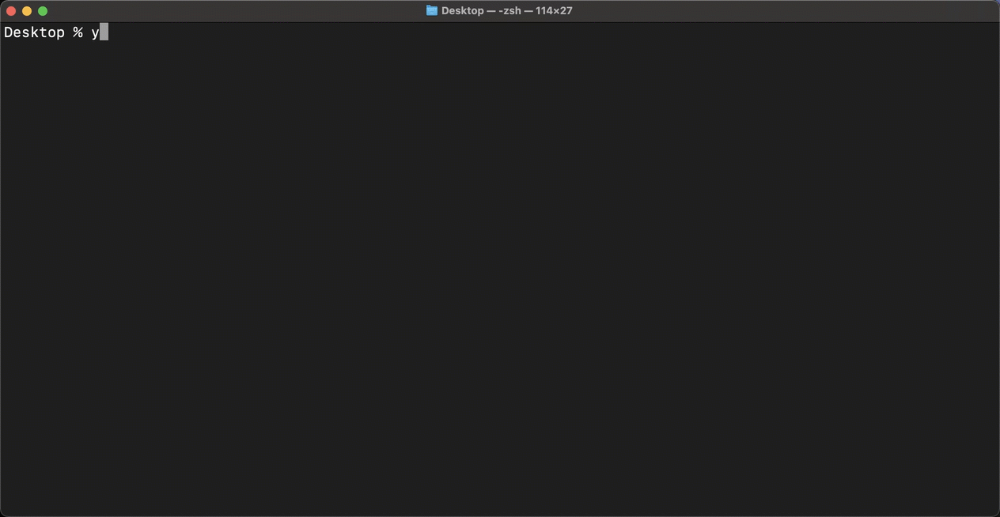
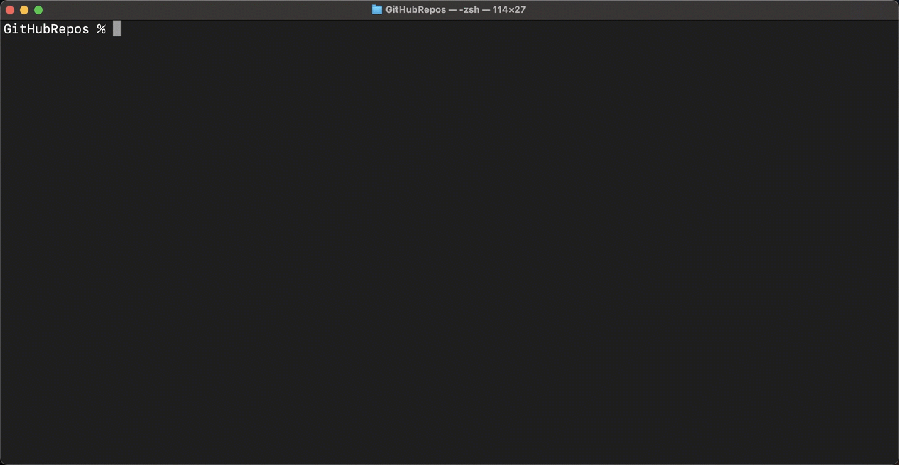

# Generator for OpenUI5/SAPUI5 projects

[![Build Status][test-image]][test-url]
[![Dependency Status][daviddm-image]][daviddm-url]
[![License Status][license-image]][license-url]

Generator which use the official UI5 tooling and support multiple deployment targets such as the SAP Business Technology Platform. This generator was build as a plug-in for the community project [Easy-UI5](https://github.com/SAP/generator-easy-ui5/) by [SAP](https://github.com/SAP/).

> As of version `0.1.0`, we strive to share core functionality (such as webapp scaffolding) with [SAP's `open-ux-tools`](https://github.com/SAP/open-ux-tools) effort, which is "a set of tools and libraries that makes it faster and easier to develop SAP Fiori applications".

## Usage with easy-ui5

```bash
$> npm i -g yo
$> yo easy-ui5 project

     _-----_
    |       |    ╭──────────────────────────╮
    |--(o)--|    │  Welcome to the easy-ui5 │
   `---------´   │        generator!        │
    ( _´U`_ )    ╰──────────────────────────╯
    /___A___\   /
     |  ~  |
   __'.___.'__
 ´   `  |° ´ Y `
```



Run you can use `npm start` (or `yarn start`) to start the local server for development.

## Standalone usage

Note the different greeting when the generator starts.

```bash
$> npm i -g yo
$> yo ./generator-ui5-project

     _-----_     ╭──────────────────────────╮
    |       |    │      Welcome to the      │
    |--(o)--|    │     easy-ui5-project     │
   `---------´   │        generator!        │
    ( _´U`_ )    ╰──────────────────────────╯
    /___A___\   /
     |  ~  |
   __'.___.'__
 ´   `  |° ´ Y `
```



## Target platforms

During the prompting phase, the generator will ask on which target platform your app should run. Currently, the following options are available:

### Static webserver

This is the most basic option. Choose this option if you want to deploy the web app in your custom environment or host it on an arbitrary server.

### Application Router @ Cloud Foundry

This is the most basic way to deploy the web app in Cloud Foundry-based environments. Besides the basic UI5 project, the generator will add an [Approuter](https://github.com/gregorwolf/SAP-NPM-API-collection/tree/master/apis/approuter) node.js-module that serves the web app.

### Application Router @ SAP HANA XS Advanced

This is the standard way to deploy the web app in SAP HANA XSA-based environments. Besides the basic UI5 project, the generator will add an [Approuter](https://github.com/gregorwolf/SAP-NPM-API-collection/tree/master/apis/approuter) node.js-module that serves the web app.

### SAP HTML5 Application Repository service for SAP BTP

This option is a more sophisticate way to serve the web app from Cloud Foundry-based environments. The generator will include all modules that are included in the **Application Router @ Cloud Foundry** and, additionally, install a module to upload the web app to the HTML5 application repository during deploy-time. You can watch [this presentation](https://www.youtube.com/watch?v=emnl-y9btdU&list=PLVf0R17F93RXT2tzhHzAr-iiYTmc9KngS&index=11&t=0s) to learn more about the benefits of using the HTML5 application repository.

### SAP Launchpad service

Use this option if you would like to develop a Fiori Launchpad application that should run on Cloud Foundry. The generator will include all modules that are included in the **SAP HTML5 Application Repository service for SAP BTP** and, additionally, install a module that adds Fiori Launchpad resources to the HTML5 application repository.

### SAP NetWeaver

Use this option if you want to deploy your application(s) to the SAP NetWeaver ABAP Repository.

## Sub-generators to avoid recurring tasks

### Add a new view

This sub-generator will create a new view (of the same type you specified during the creating of your project) and a new controller and route. If you have OPA5 tests, you can add a corresponding page object now or later with another sub-generator.

```shell
$> yo easy-ui5 project newview
```

### Create a custom control

Run the following command from your project's root to scaffold a custom control.

```shell
$> yo easy-ui5 project newcontrol
```

### Add a new model

This sub-generator will create a new model in your manifest. Currently, [JSON](https://sapui5.hana.ondemand.com/#/api/sap.ui.model.json.JSONModel) and [OData v2](https://sapui5.hana.ondemand.com/#/api/sap.ui.model.odata.v2.ODataModel) models are supported with various configuration options.

```shell
$> yo easy-ui5 project newmodel
```

### Add a new component usage

This sub-generator will add a new component usage for component reuse to your manifest.

```shell
$> yo easy-ui5 project newcomponentusage
```

### OPA5 tests

This sub-generator will add a basic [OPA5](https://openui5.hana.ondemand.com/topic/2696ab50faad458f9b4027ec2f9b884d) test setup. You can add page objects now or later with another sub-generator.

```shell
$> yo easy-ui5 project opa5
```

This sub-generator will create an OPA5 page object and add it to your journeys:

```shell
$> yo easy-ui5 project newopa5po
```

This sub-generator will create an OPA5 journey and add it to your test page:

```shell
$> yo easy-ui5 project newopa5journey
```

### QUnit tests

This sub-generator will add a basic [QUnit](https://qunitjs.com/) setup. It will ask you for your app name and namespace if it is not yet part of an easy-ui5 project. You can add QUnit tests now or later with the `newqunittest` sub-generator.

```shell
$> yo easy-ui5 project qunit
```

This sub-generator will create a new QUnit test either in a basic setup or with [Sinon.JS](https://sinonjs.org/) to create standalone test spies, stubs and mocks in your QUnit tests:

```
$> yo easy-ui5 project newqunittest
```

### UIVeri5 tests

This sub-generator will add a basic [UIVeri5](https://github.com/SAP/ui5-uiveri5) test. It will ask you for test configuration and names of the suite and spec. You can add page objects now or later with another sub-generator.

```shell
$> yo easy-ui5 project uiveri5
```

This sub-generator will create a UIVeri5 page object and a new test that shows how to use the page object:

```shell
$> yo easy-ui5 project newuiveri5po
```

This sub-generator will create a UIVeri5 spec file:

```shell
$> yo easy-ui5 project newuiveri5spec
```

## Deployment

Depending on your target platform you'll need to install additional tools:

### Cloud Foundry

Required tools:

1. [Create a free account](https://developers.sap.com/mena/tutorials/hcp-create-trial-account.html) on SAP BTP Trial
2. [Install](https://developers.sap.com/tutorials/cp-cf-download-cli.html) the Cloud Foundry Command Line Interface

    ```shell
    cf login
    ```

3. [Install](https://github.com/cloudfoundry-incubator/multiapps-cli-plugin) the MultiApps CF CLI Plugin

Deployment steps:

Call this command from the root directory to deploy the application to Cloud Foundry

```shell
$> npm run deploy
```

### SAP HANA XSA

Required tools:

1. SAP HANA or [create a free](https://developers.sap.com/group.hxe-install-binary.html) SAP HANA Express system
2. [Install](https://developers.sap.com/tutorials/hxe-ua-install-xs-xli-client.html) the XS CLI Client

    ```shell
    $> xs login
    ```

Deployment steps:

Call this command from the root directory to deploy the application to HANA XSA

```shell
$> npm run deploy
```

### SAP NetWeaver

Deployment steps:

Update the ui5.yaml file with your system settings (user, password & server) and ABAP repository settings (package, BSP Container & Transport).
Run following command to deploy the application to SAP NetWeaver

```shell
$> npm run deploy
```

## Shared functionality with SAP's `open-ux-tools`

- scaffolding a new webapp with view type `XML` uses [`@sap-ux/fiori-freestyle-writer`](https://www.npmjs.com/package/@sap-ux/fiori-freestyle-writer)


## Embedded Technologies

This project leverages (among others) the following Open Source projects:

-   [UI5 Build and Development Tooling](https://github.com/SAP/ui5-tooling)
-   [OpenUI5. Build Once. Run on any device.](https://github.com/SAP/openui5)
-   [SAP open-ux-tool](https://github.com/SAP/open-ux-tools)

## Support

Please use the GitHub bug tracking system to post questions, bug reports or to create pull requests.

## Contributing

We welcome any type of contribution (code contributions, pull requests, issues) to this generator equally.

[test-image]: https://github.com/ui5-community/generator-ui5-project/actions/workflows/main.yml/badge.svg
[test-url]: https://github.com/ui5-community/generator-ui5-project
[daviddm-image]: https://status.david-dm.org/gh/ui5-community/generator-ui5-project.svg
[daviddm-url]: https://david-dm.org/ui5-community/generator-ui5-project
[license-image]: https://img.shields.io/github/license/ui5-community/generator-ui5-project.svg
[license-url]: https://github.com/ui5-community/generator-ui5-project/blob/main/LICENSES/Apache-2.0.txt
